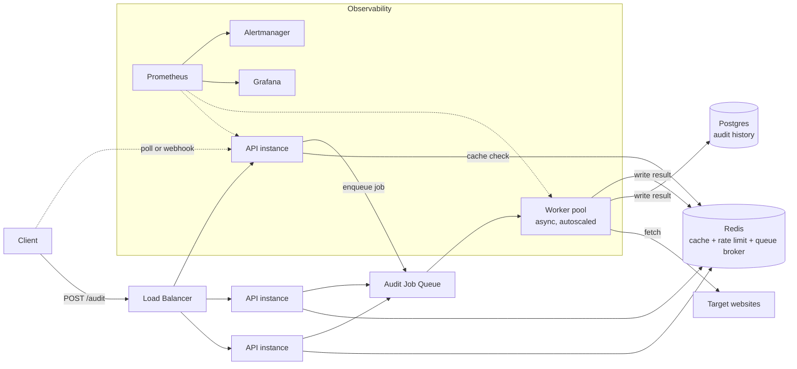

# URL Audit Service at Scale — 10,000 audits/day, 500 concurrent burst, SLA-backed

Task B assumes a customer-facing SLA on response time. The single-process
design in Task A is fine for a demo; at this load it falls over in one
specific way — a burst of slow target sites ties up every worker holding an
open connection, and everything behind it queues on the request itself. The
architecture below exists to decouple "accepting the request" from "doing the
slow, unreliable I/O," so a burst degrades gracefully instead of taking the
whole service down.

## 1. Architecture

**Request flow**

1. API instance receives the request, checks Redis cache — cache hits return
   immediately (this is most of the SLA win, since repeat audits are common).
2. On a miss, the API validates the URL, writes a `queued` job to Redis
   (via RQ) and returns a `202` with a job ID immediately, rather than holding
   the HTTP connection open for the outbound fetch. The client polls
   `GET /audits/{id}` or receives a webhook.
3. A separate autoscaled worker pool — not the API process — pulls jobs and
   does the actual outbound fetch, under the same timeout and concurrency
   controls as Task A, just scaled horizontally.
4. Results land in Postgres (durable history, supports the "audit an account
   over time" use case) and Redis (fast read for the polling client).

This is the one structural change from Task A: **the API layer is now
decoupled from the slow I/O**. A synchronous request/response model at this
concurrency means the target site's latency becomes *your* SLA; queueing
means your SLA is "how fast we accept the job," which you control.

## 2. Technology choices

| Component | Choice | Rejected alternative | Why |
|---|---|---|---|
| Queue/broker | Redis + RQ | Celery + RabbitMQ | Celery's feature set (chains, canvases, complex routing) isn't needed for one job type. Redis is already in the stack for caching, so RQ avoids running a second piece of broker infrastructure for a team this size. |
| Persistent store | Postgres | Keep everything in Redis | Redis is fast but not the right tool for "show me this account's audit history for the last 90 days" — that's a relational query pattern, and Redis eviction policies make it an unsafe system of record. |
| Worker concurrency model | `asyncio` workers, N processes | Thread pool per worker | The workload is I/O-bound (waiting on target sites), so async gives far more concurrent fetches per worker process than OS threads at a fraction of the memory. |
| Autoscaling signal | Queue depth | CPU-based autoscaling | Workers spend most of their time waiting on network I/O, not burning CPU — CPU-based scaling would never trigger during the exact burst it needs to catch. Queue depth (jobs waiting > N) is the honest signal. |
| API deployment | Horizontal pod/service replicas behind a load balancer | Single large instance (vertical scaling) | 500 concurrent requests needs redundancy as much as raw capacity — a single instance is also a single point of failure the SLA can't tolerate. |

## 3. Most likely failure modes at this scale

**1. A batch of targets that are slow-but-not-timing-out clogs the worker pool.**
A handful of clients auditing many slow URLs at once can occupy every worker
below the timeout threshold, starving other clients.
*Mitigation:* per-client concurrency cap in addition to the global one (a
single client can never hold more than, say, 20% of worker capacity), plus
the existing per-request timeout as the hard backstop.

**2. Redis becomes a single point of failure** — it's serving cache, rate
limiting, and the job queue simultaneously.
*Mitigation:* Redis with a managed HA setup (primary + replica, automatic
failover). If Redis is briefly unavailable, the API degrades rather than
fails: skip the cache (fetch fresh), and reject new queue writes with a `503`
rather than accepting jobs it can't track — visible, not silent, data loss.

**3. A burst of 500 concurrent requests arrives faster than workers can
autoscale.**
Autoscaling has a startup lag (new workers take time to come up); a sudden
spike can outrun it.
*Mitigation:* the queue absorbs the burst — jobs wait rather than get
dropped — combined with a maximum queue depth that returns `429` with a
`Retry-After` header once exceeded, so the system fails loudly and instructs
the client, instead of degrading invisibly for everyone.

## 4. Monitoring, alerting, and rollback

**Key metrics**

| Metric | Alert threshold |
|---|---|
| API p95 latency (accept-to-response) | > 500ms for 5 min |
| Worker job p95 latency (queued-to-complete) | > 2x configured timeout for 5 min |
| Queue depth | > 1,000 jobs waiting |
| Error rate (5xx / total) | > 2% over 5 min |
| Cache hit rate | Alert on *drop* below 20% (signals cache/Redis issue, not just "traffic changed") |
| Redis/Postgres availability | Any failed health check |

Metrics collected via Prometheus (worker and API both expose a `/metrics`
endpoint), visualized in Grafana, alerts routed through Alertmanager to
on-call.

**Rollback**

Deploys are blue-green: the new version stands up alongside the old one and
takes traffic only after its own health checks (including a synthetic audit
against a known-good test URL) pass. If error rate or p95 latency breaches
threshold within the first 10 minutes of a deploy, traffic automatically
routes back to the previous version — no manual intervention needed for the
common case. Manual rollback (redeploy previous image tag) remains available
as a fallback if the automated guard itself misbehaves.
